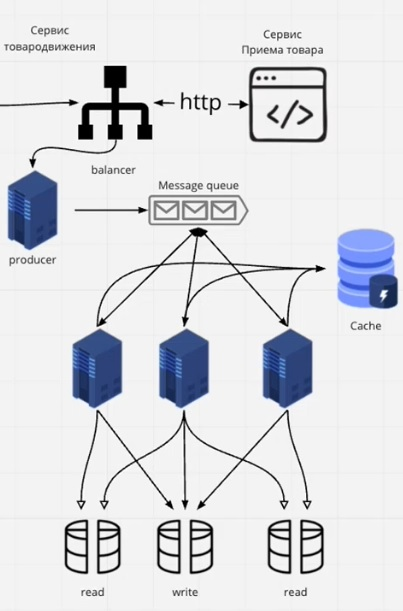

1. [[#Масштабирование]]
2. [[#Балансировка нагрузки]]
3. [[#Кеширование]]
4. [[#Репликация]]
5. [[#Шардирование]]
6. [[#Очереди сообщений]]
7. [[#SQL & NoSQL]]

### Масштабирование
Вертикальное - улучшить узел, машину, т.е. лучше процессор, больше памяти, диск, пропускная способность интернета

Горизонтальное - увеличиваем количество узлов, нод

### Балансировка нагрузки
Балансировщик - позволяет направлять нагрузку по заданному алгоритму на тот или иной узел. Видит список узлов. Самый популярный - nginx.

**Алгоритмы распределения нагрузки**
Round robin (RR) - запросы по кругу
Weighted RR - хостам назначаются веса с учетом их мощности (больше реквестов на мощные)
Least connections / outstanding requests - выбираем машину с наименьшим количеством незавершенных запросов и с минимальным числом сетевых подключений
Destination/source hash scheduling - отправляем на машину в зоне клиента
Sticky sessions - закрепляет сессию за одним сервером или группой серверов

### Кеширование
Кеширование - уменьшаем нагрузку на сервера, базы данных
cache hit & miss - попадание и непопадание в кэш

Кэш - KV база данных, reddis, memcached - in-memory DB

Pull-push - идет запрос на получение данных, пытаемся достать из кэша, если нету - идем в бд и ставим в кэш, возвращаем. В кэше данные имеют время жизни.

### Репликация
Репликация данных - хранение одни и те же данные на разных репликах, одна реплика на запись, другие на чтение.
Есть мастер и слейвы, только мастер пишет.

### Шардирование
Шардирование - разбиение базы данных на относительно независимые части
Шардирование частный случай партицирования

Vertical partitioning (партицирование): разделение таблицы в рамках одного сервера
Horizontal partitioning (шардирование): разбиение таблиц по нескольким серверам

Ключ шардирования - позволяет выбрать шард (сервер) куда направить запрос.

### Очереди сообщений
Зачем - дать возможность сервисам обрабатывать запросы, когда они освободятся

### SQL & NoSQL

### Шаги масштабирование сервиса до миллиона пользователей
Разделить сервис на микросервисы
Поместить базу данных на отдельный сервер
Развернуть сервис на отдельном, мощном сервере
Добавить балансировщик и увеличить количество серверов
Шардировать, реплицировать базу для распределения нагрузки
Использовать NoSQL бд вмсете с SQL базами
Добавить очереди для обмена сообщений между сервисами
Кешировать результаты тяжелых вычислений, использовать CDN для гео-кеширования