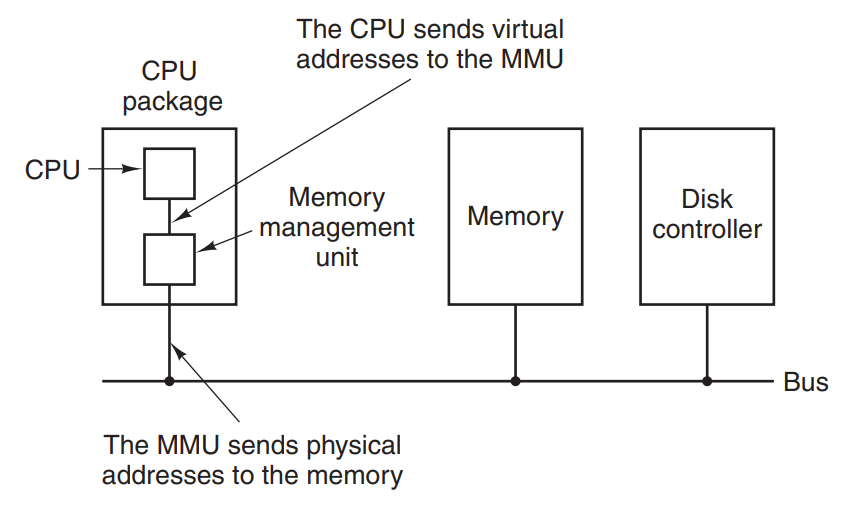
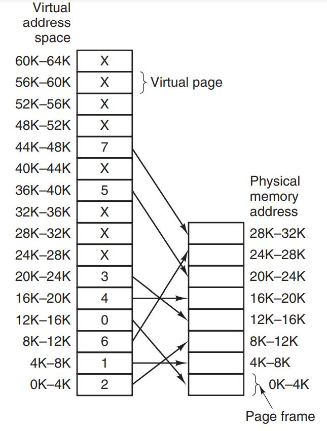
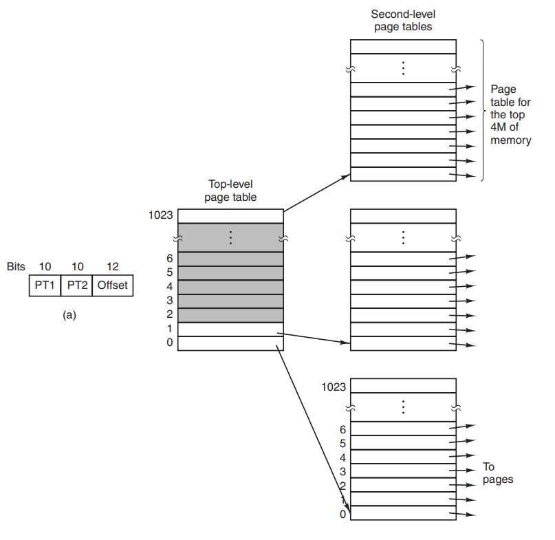
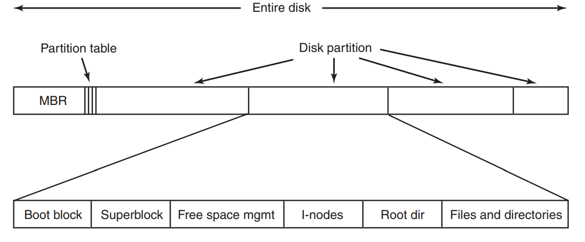

## Процессы и потоки
#### Процесс
Контекст, состояние программы - код программы, память (виртуальное адресное пространство), ресурсы (открытые файлы, сокеты), состояние регистров.  

Одно ядро процессора можно выполнять лишь один процесс одновременно.

#### Создание процесса
Из уже существующих процесса, системный вызов fork - создает копию процесса, далее из созданного процесса вызов execve - заменить память процесса на указанную программу.  

В Windows достаточно одного системнго вызова - CreateProcess.

#### Поток
Контекст выполнения процесса, общее адресное пространство с процессом, свой стек, состояние регистров. Мини-процесс.

#### Состояния процесса
1. Running - исполняется на ядре процессора в данный момент
2. Ready - готов исполняться, ожидает
3. Sleeping/blocked - не исполняет, ждет какого-то события, например записи в консоль

#### Планировщик процессов
Сменой состояний процессора между running и ready занимаются планировщик операционной системы. 

#### Смена контекста
Переход из user-mode в kernel-mode. Сохранение состояния текущего процесса, включая его регистры, далее должен быть выбран новый процесс алгоритмом планировщика. 

#### Прерывание таймера (clock interrupt)
Каждый квант происходит прерывание таймера, после которого вызывается обработчик прерываний таймера и выбирается новый процесс - вытесняющий планировщик.

#### Round-Robin планирование
По истечении кванта, исполнение передается следующему процессу в очереди, а текущий помещается в конец очереди

#### Priority Scheduling
Выбираем процесс с наибольшим приоритетом из Runnable процессов. Чтобы процесс с высоким приоритетом не выполнялся вечно, будет каждый квант выполнения уменьшать его приоритет.

## Управление памятью
#### Адресные пространства
Абстракция над физической памятью. Хотим изолировать память процессов друг от друга, обеспечить мультизадачность. Безопасность.

#### Base and Limit регистры
Самый простой способ. Есть два регистра процессора, Base - начало физической памяти программы, к нему добавляем адреса адресного пространства процесса. Limit - размер программы. При обращении по какой-то ячейке памяти, к Base добавляется оффсет и это значение сравнивается с Limit - если больше, выдает SEGFAULT - выход за пределы своей памяти.

#### Swapping
Процесс перемещения памяти программы на диск и наоборот

#### Virtual memory
Есть проблема выполнения программ, которые целиком не умещаются в физическую память либо множества программ, каждая из которых умещается, но все - нет. Swapping всей программы целиком слишком медленный. Решение - виртуальные адресные пространства для каждой программы, каждое пространство разбивается на страницы (pages) фиксированного размера, обычно 4кб. Каждая страница мапится на физическую память. При этом, не все страницы пространства должны быть в физической памяти, чтобы программа могла выполняться. 

Программа может работать со страницами которые уже в физической памяти, если же программа обращается к странице, которая находится на диске (swap-space), то для начала эту страницу нужно перенести в физическую память. 

#### Paging
Процесс организации перемещения страниц из физической памяти на диск и наоборот.

MMU - Memory Managment Unit - часть CPU, отвечающая за маппинг виртуальных адресов на физические.

#### Page table
In-memory таблица страниц (page table) мапит виртуальные адреса на физические. Используется MMU. На каждую страницу приходится одна запись (page table entry - PTE). Кэш таких записей называется **TLB (translation lookaside buffer)**, используется для ускоренной загрузки страниц из кэш-памяти.

Запись о странице также содержит биты информации:
1. P - present bit - находится ли страница сейчас в физической памяти, либо ее нужно подкачать с диска. **Page Fault** - если страницы не оказалось в памяти, приведет к прерыванию и подкачке страницы с диска в физическую память
2. A - accessed bit, когда в последний раз использовалась страница. Нужен для того, чтобы выгружать неиспользуемые страницы в раздел подкачки (swap space).
3. W - dirty/write bit, была ли страница изменена. Нужен, чтобы понимать, нужно ли обновлять сохраненную страницу на диске, если она была изменена.

Виртуальный адрес разбит на две части. Например, из 16 бит - первые 4 бита указывают на номер (индекс) страницы в Page table, оставшиеся 12 бит - оффсет на конкретный байт памяти из 4096 байтов.  

Таблица памяти не хранит адреса страниц на диске - это дело операционной системы, когда будет вызвано соответствующее Page Fault прерывание.

#### TLB (translation lookaside buffer)
Кэш записей страниц, находится в MMU. Нужен для быстрого маппинга страниц. Когда виртуальный адрес поступает в MMU, сначала проверяется наличие записи в TLB - если запись найдена (cache hit), сразу можем вернуть соответствующий странице физический адрес. Иначе (cache miss) ищем запись в Page Table, при этом сохраняем ее в TLB.

Soft miss - страницы не оказалось в TLB, смотрим в Page Table  
Hard miss - страницы не оказалось в памяти, загрузим с подкачки. 

#### Multilevel Page Tables
Для 32-битного виртуального адреса разобьем его на три составляющие - 10 бит для номера первой таблицы, 10 бит для номера второй, и оставшиеся 12 offset бит для адресации внутри одной страницы. Всего получаем 2^20 страниц.

Суть мультиуровневых таблиц в том, что мы можем не держать все таблицы в памяти, поэтому будем экономить большое количество памяти.

## Файловые системы
#### Файловая система
Абстракция над дисковым хранилищем. Windows использует FAT, NTFS, Linux - ext4, btrfs. Один диск может быть разбит на несколько разделов (Partition), на каждом из которых может быть своя файловая система. В начале диска записан сектор **MBR (Master Boot Record)**, который нужен для загрузки операционной системы. В конце MBR записана Partition Table - где начинается и заканчиваются разделы (partition) диска. В начале каждого partition есть **boot block**, который загружает операционную систему на этом разделе. Также в разделе есть **superblock**, который описывает тип, размер, структуру всей файловой системы, директории, файлы. 

Форматирование - запись на диск суперблока.   
Монтирование - чтение суперблока и создание структур памяти ФС.  

#### Реализации файлов
**Последовательная реализация** - храним адрес первого блока на диске и размер всего файла, пишем последовательно. Проблема - фрагментация данных. Дефрагментация слишком медленная на диске.  

**Связный список** - список из адресов блоков диска. Каждый блок будет разбит на две части - в первой указатель на следующий блок, во второй уже данные. Слишком медленно, т.к. теряется свойство random access - чтобы прочитать блок N, нам нужно прочитать первый блок списка и переходить далее по списку, пока не найдем N.  Кроме того, не весь блок используется для данных.

**Один большой список** - единый список с информацией по всем блокам в системе, теперь весь блок используется для данных, а random access существенно быстрее. Недостаток - все списки всех файлов должны быть в памяти для эффективных переходов. Можно подгружать частями в память, но тогда теряется эффективность. Файловая система FAT.

**Index-node (i-node)** - индексный узел, теперь с каждым файлом ассоциируем структуру данных, которую нужно загрузить в память только когда файл открыт, и которая хранит атрибуты файла и цепочку блоков. Также это массив, поэтому не нужно ходить по списку для random access. Файловая система ext.

## Ввод/вывод

