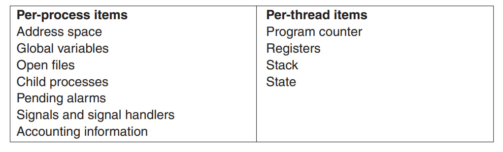

## Процессы и потоки
#### Процесс
Контекст, состояние программы - код программы, память (виртуальное адресное пространство), ресурсы (открытые файлы, сокеты), состояние регистров.  

Одно ядро процессора можно выполнять лишь один процесс одновременно.

#### Создание процесса
Из уже существующих процесса, системный вызов fork - создает копию процесса, далее из созданного процесса вызов execve - заменить память процесса на указанную программу.  

В Windows достаточно одного системнго вызова - CreateProcess.

#### Поток
Контекст выполнения процесса, общее адресное пространство с процессом, свой стек, состояние регистров. Мини-поток.

#### Состояния процесса
1. Running - исполняется на ядре процессора в данный момент
2. Ready - готов исполняться, ожидает
3. Sleeping/blocked - не исполняет, ждет какого-то события, например записи в консоль

#### Планировщик процессов
Сменой состояний процессора между running и ready занимаются планировщик операционной системы. 

#### Смена контекста
Переход из user-mode в kernel-mode. Сохранение состояния текущего процесса, включая его регистры, далее должен быть выбран новый процесс алгоритмом планировщика. 

#### Прерывание таймера (clock interrupt)
Каждый квант происходит прерывание таймера, после которого вызывается обработчик прерываний таймера и выбирается новый процесс - вытесняющий планировщик.

#### Round-Robin планирование
По истечении кванта, исполнение передается следующему процессу в очереди, а текущий помещается в конец очереди

#### Priority Scheduling
Выбираем процесс с наибольшим приоритетом из Runnable процессов. Чтобы процесс с высоким приоритетом не выполнялся вечно, будет каждый квант выполнения уменьшать его приоритет.

## Управление памятью
#### Адресные пространства
Абстракция над физической памятью. Хотим изолировать память процессов друг от друга, обеспечить мультизадачность. Безопасность.

#### Base and Limit регистры
Самый простой способ. Есть два регистра процессора, Base - начало физической памяти программы, к нему добавляем адреса адресного пространства процесса. Limit - размер программы. При обращении по какой-то ячейке памяти, к Base добавляется оффсет и это значение сравнивается с Limit - если больше, выдает SEGFAULT - выход за пределы своей памяти.

#### Swapping
Процесс перемещения памяти программы на диск и наоборот

#### Virtual memory
Есть проблема выполнения программ, которые целиком не умещаются в физическую память либо множества программ, каждая из которых умещается, но все - нет. Swapping всей программы целиком слишком медленный. Решение - виртуальные адресные пространства для каждой программы, каждое пространство разбивается на страницы (pages) фиксированного размера, обычно 4кб. Каждая страница мапится на физическую память. При этом, не все страницы пространства должны быть в физической памяти, чтобы программа могла выполняться. 

Программа может работать со страницами которые уже в физической памяти, если же программа обращается к странице, которая находится на диске (swap-space), то для начала эту страницу нужно перенести в физическую память. 

#### Paging
Процесс организации перемещения страниц из физической памяти на диск и наоборот.

MMU - Memory Managment Unit - часть CPU, отвечающая за маппинг виртуальных адресов на физические.

#### Page table
In-memory таблица страниц (page table) мапит виртуальные адреса на физические. Используется MMU. На каждую страницу приходится одна запись (page table entry - PTE). Кэш таких записей называется **TLB (translation lookaside buffer)**, используется для ускоренной загрузки страниц из кэш-памяти.

Запись о странице также содержит биты информации:
1. M - находится ли страница сейчас в физической памяти, либо ее нужно подкачать с диска
2. A - accessed bit, когда в последний раз использовалась страница. Нужен для того, чтобы выгружать неиспользуемые страницы в раздел подкачки (swap space).
3. W - dirty/write bit, была ли страница изменена. Нужен, чтобы понимать, нужно ли обновлять сохраненную страницу на диске, если она была изменена.

## Файловые системы

## Ввод/вывод

